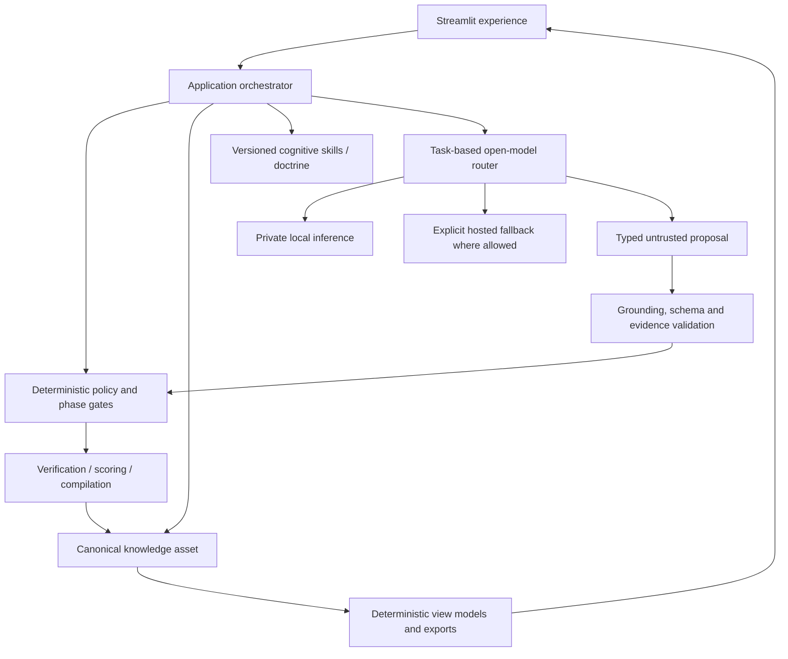
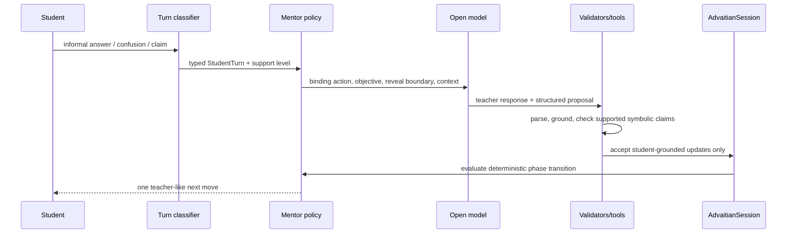
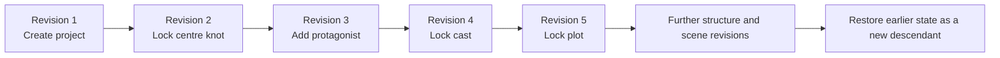

# Advaitian–Narrative Architecture Solution

**Status:** Session architecture record
**Date:** 23 August 2026
**Products:** ThinkMath / Advaitian Commentary Engine and Narrative Architect
**Scope boundary:** This document describes two independent creative/learning applications. It does not define, modify, or depend on Decision Studio.

## 1. Executive summary

The session produced two related but distinct product architectures:

1. **ThinkMath** is an algorithmically governed, open-model-powered mathematics mentor. Its purpose is to teach mathematical thinking and the Advaitian Six-Point framework without behaving like an answer engine. A deterministic mentor policy owns learning progression, hint disclosure, recovery behavior, verification labels, and proof release. Open models interpret informal reasoning, compare mathematical directions, and speak naturally like a teacher.
2. **Narrative Architect** is a screenplay construction studio. Its purpose is to build structurally stronger, high-scoring first drafts from a one-line centre knot through characters, plot, structure, engineered scenes, compilation, and an evidence-facing construction scorecard. A canonical Narrative Knowledge Asset owns the blueprint. A governed skill library holds screenplay craft knowledge. Lightweight open models are bounded creative generators, while deterministic services own state, phase gates, structure, scoring arithmetic, compilation, and provenance.

Both systems follow the same foundational rule:

> Conversation is the experience, but conversation is not canonical truth.

The canonical knowledge asset is the durable reasoning or construction state. Models propose; deterministic policy validates; the user remains the authority.

## 2. Shared architectural doctrine

### 2.1 Hybrid intelligence, not prompt-only intelligence

Neither product is designed as one large prompt wrapped in a chat UI. Intelligence is divided among:

- a canonical, typed domain asset;
- deterministic policies and validators;
- versioned cognitive skills or doctrine;
- task-routed open/open-weight models;
- bounded structured model output;
- human approval or student-grounding gates;
- evidence, verification, and provenance;
- a presentation layer that makes progression understandable.

The shared operating formula is:

> The model proposes; deterministic tools test; application policy decides; the model communicates.

### 2.2 Canonical-state principle

Chat transcripts are verbose, contradictory, provider-dependent, and difficult to validate. Therefore:

- ThinkMath stores mathematical understanding in `AdvaitianSession`.
- Narrative Architect stores the screenplay blueprint in immutable NKA revisions.
- Transcript deletion or summarization must not delete accepted reasoning or story decisions.
- Generated artifacts must bind to a specific canonical revision.
- Model output is untrusted until it passes a typed validation and ownership gate.

### 2.3 Deterministic authority

Deterministic code owns mechanics where correctness, replay, or auditability matters:

- identifiers and ordering;
- phase and reveal boundaries;
- typed parsing and validation;
- revision/version lineage;
- arithmetic and aggregation;
- readiness and release thresholds;
- compilation;
- model-role eligibility;
- provenance traversal;
- persistence consent and privacy controls.

Models remain deliberately useful. They own semantic interpretation, candidate generation, comparison, explanation, natural language, and bounded creative drafting. They do not silently own truth.

### 2.4 Human authority

- A student is not credited with a mathematical idea merely because a model generated it.
- An author’s screenplay is not revised merely because a model suggested an alternative.
- Recovery statements such as “I don’t know” or “I am confused” change the support level, not canonical mathematical evidence.
- Generated screenplay content remains a proposal until the author preserves or locks it.
- Undo creates a new restoring revision; accepted history is not rewritten.

## 3. Combined full-stack view



The two products reuse the pattern, not each other’s domain state. ThinkMath’s mathematics asset and Narrative’s screenplay asset remain separate.

---

# Part I — ThinkMath / Advaitian Commentary Engine

## 4. Product intent

ThinkMath is a Socratic olympiad mathematics mentor. It is optimized for the transformation:

```text
initial instinct
  -> observation
  -> Seed
  -> plausible directions
  -> Setup
  -> Move
  -> Closure
  -> checked Six-Point commentary
  -> transfer to a new surface form
```

It must:

- teach the student to recognize mathematical structure;
- teach the Advaitian Six-Point framework;
- ask one useful question at a time;
- accept confusion, uncertainty, disagreement, and partial ideas naturally;
- preserve promising student thinking without praising unsupported claims;
- avoid revealing the operational move prematurely;
- release full commentary only after a validated Setup–Move–Closure path;
- remain useful when inference capacity is temporarily unavailable.

## 5. Student experience architecture

### 5.1 Learn

The primary surface is a calm, teacher-like conversation.

- One precise question is asked at a time.
- The mentor acknowledges the student’s actual emotional/cognitive state.
- Provider controls do not dominate the student interface.
- Curated demonstration journeys remain available without inference.
- The student controls disclosure through a four-level hint ladder.

The hint ladder is:

1. **Small experiment** — reveal a useful test case, not the solution.
2. **Archetype nudge** — name a likely structural family without its operational move.
3. **Direction map** — compare plausible mechanisms without revealing convergence.
4. **Pivot shadow** — reveal the shape of the pivot while retaining the decisive step.

### 5.2 Thinking Map

The Thinking Map is a deterministic projection of `AdvaitianSession`. It separates:

- student observations;
- Seed hypotheses;
- candidate archetypes;
- rejected approaches;
- current proof obligation;
- Setup, Move, and Closure;
- progressively revealed next actions.

Model-inferred directions appear as untrusted working hypotheses, not as student-owned knowledge.

### 5.3 Commentary

Checked commentary is a structured learning artifact, not merely another chat message. It contains the Six-Point payoff:

- Seed;
- Brute-force surface;
- Pivot;
- Pitfall;
- Connection;
- Takeaway.

The artifact carries an assurance label and ends with a same-Seed transfer challenge in a different surface form.

### 5.4 My Journey

The journey view provides:

- a visual before/after reasoning map;
- a Pattern Passport based on completed structural learning;
- downloadable session and passport artifacts;
- no points or streaks that reward shallow activity.

A passport entry requires an author-confirmed complete MVC rather than message volume.

## 6. Canonical mathematics asset

`thinkmath.domain.AdvaitianSession` is the source of truth.

### 6.1 Principal state

The asset currently records:

- schema version and revision;
- problem statement;
- phase and difficulty tier;
- student observations;
- Seed hypotheses;
- archetype hypotheses with evidence, role, and confidence;
- MVC: Setup, Move, Closure, family, validation state, and notes;
- rejected approaches and connections;
- hint level;
- proof status and verification results;
- provenance;
- bounded untrusted `ProblemMap`;
- mentor action history;
- claim ledger and current proof obligation;
- student reflection.

### 6.2 Trust partitions

ThinkMath intentionally maintains three different knowledge classes:

1. **Student-grounded state** — accepted only when the proposal is supported by the student’s current language.
2. **Untrusted problem map** — model-inferred directions, obligations, misconceptions, and candidate MVC used to guide teaching but not attributed to the student.
3. **Reviewed/compiled knowledge** — curated demonstration maps and known corrections that can be served without fresh analysis.

The separation prevents model confidence from becoming false student progress.

## 7. Learning state machine

ThinkMath uses three canonical phases:

| Phase | Meaning | Progression requirement |
|---|---|---|
| 1. Seed | Observe structure and form a hypothesis | Student-grounded observation, Seed, or archetype evidence |
| 2. Directions | Compare mechanisms and complete MVC | Structural hypothesis plus Setup–Move–Closure development |
| 3. Convergence | Release checked synthesis | Complete and independently validated MVC |

The model may suggest a phase. `state_machine.evaluate_transition` owns the transition.

An explicit request for “the full answer,” “Stage 2,” or “Six-Point commentary” cannot bypass the MVC gate. The mentor returns to the missing proof component instead.

## 8. Governed mentor engine

### 8.1 Turn classification

`conversation.classify_student_turn` distinguishes substantive reasoning from:

- “I don’t know”;
- confusion;
- requests for an example;
- disagreement;
- requests to repeat or simplify;
- other recovery language.

Recovery does not mutate mathematical truth or advance a phase.

### 8.2 Typed teaching actions

The deterministic mentor policy selects one action such as:

- ask for an observation;
- narrow the current goal;
- test the smallest useful case;
- offer two bounded directions;
- demonstrate one micro-step;
- change representation;
- check a disputed step;
- correct a reviewed misconception;
- test an assertive claim;
- compare directions;
- complete MVC;
- stress-test the proposed proof path;
- release checked commentary.

Each `MentorDecision` carries:

- the selected action;
- teaching objective;
- reveal boundary;
- deterministic rationale;
- required model capability;
- optional correction, counterexample, and proof obligation.

### 8.3 Recovery escalation

Repeated uncertainty increases support deterministically:

1. narrow the goal;
2. use the smallest useful case;
3. offer two concrete choices;
4. model one justified micro-step;
5. change representation and rebuild.

This creates human-like patience without giving a model unrestricted control of pedagogy.

### 8.4 Anti-repetition and teacher-quality guardrails

`ensure_teacher_response`:

- keeps one question per turn;
- detects repeated or near-duplicate questions;
- replaces empty or generic model responses with deterministic teaching actions;
- preserves reviewed misconception corrections;
- prevents a substantive proof attempt from being answered with a generic reset.

## 9. ThinkMath turn pipeline



The normal turn is designed to use one model request containing the visible teaching response and a private structured proposal. Private state blocks are removed before rendering.

## 10. Problem maps, caching, and compiled intelligence

`ProblemMap` is bounded, untrusted working intelligence. It can record:

- observations;
- structural directions;
- proof obligations;
- misconceptions;
- candidate MVC;
- current goal;
- confidence and source.

Confident maps are reused:

- within the current session;
- through a 256-entry process-local LRU cache keyed by normalized problem fingerprint;
- through curated compiled maps for demonstration or reviewed problem families.

Caching reduces repeated inference cost. It does not certify a mathematical map. Promotion into a durable historical IMO library requires human or formal review.

## 11. Verification and proof release

### 11.1 Deterministic checks

ThinkMath uses deterministic checks for:

- the Six-Point section contract;
- supported symbolic equivalence through a restricted SymPy parser;
- known descent-closure failure patterns;
- constraint trace indicators;
- MVC completeness;
- phase/reveal gates.

The symbolic parser rejects attribute access, private names, unsupported syntax, and overlong expressions. A failed plain identity is labelled for review because unencoded assumptions may exist.

### 11.2 Independent critic

Arbitrary prose proofs are not declared formally verified by deterministic heuristics. A qualified independent critic is required for checked full commentary.

- Critic output defaults to `UNVERIFIED`, never `SOLID`.
- Missing, malformed, or unavailable critic output fails closed.
- A mentor/commentary model cannot validate its own proof.
- Known deterministic failures override model confidence.

### 11.3 Assurance labels

The application distinguishes:

- structural draft;
- partially verified;
- unverified.

The UI must not imply stronger proof assurance than the recorded evidence supports.

## 12. Open-model stack and capacity strategy

### 12.1 Roles

Models are registered by task, capability, licence, context, locality, and stability—not selected from generic leaderboard rank.

Current intended roles include:

| Role | Typical open model | Purpose |
|---|---|---|
| Conversational mentor | Qwen3-class 8B or qualified equivalent | Natural Socratic turns and recovery |
| Deep commentary | gpt-oss 20B/120B or evaluated equivalent | Full structural synthesis |
| Independent critic | Qwen2.5-Math or DeepSeek-R1 distill | Semantic proof review |

Promotion requires repository-specific golden evaluation.

### 12.2 Providers

- **Ollama** is the private/local-first route.
- **Groq** is an optional quota-bound public-demo route restricted to registered open/open-weight models.
- Provider-free curated demonstrations and deterministic mentor fallbacks remain available.
- A model being open source does not make hosted inference unlimited; compute and rate limits remain operational constraints.

### 12.3 Resilience ladder

`run_model_ladder`:

- routes by task capability;
- retries a transient failure once with jitter;
- classifies authentication, billing, daily quota, minute quota, TPM, missing model, transient, and fatal failures;
- uses `Retry-After` where available;
- continues across qualified candidates;
- falls back to the already-selected deterministic teaching action when all conversational routes fail.

Full proof release still fails closed if qualified verification is unavailable.

## 13. Rendering and structured output

Open models can emit malformed Markdown or private JSON. The rendering boundary therefore:

- strips `thinkmath-state` blocks;
- strips schema-matching generic JSON fences;
- tolerantly parses bounded structured state;
- repairs unmatched display-math delimiters;
- repairs inline Six-Point headings and list formatting;
- prevents raw state envelopes from appearing as mentor speech.

This directly addresses earlier hint responses that exposed JSON instead of readable teaching text.

## 14. ThinkMath privacy and security

- Persistence is off by default.
- Firebase writes occur only after explicit session-saving consent or explicit Bible contribution.
- Records include a 30-day expiry marker.
- Current-session copies can be deleted by the user.
- Admin mode is fail-closed and uses constant-time credential comparison.
- No fallback administrator PIN exists in source.
- Raw provider exceptions are limited to authenticated administration surfaces.
- Hosted processing is described honestly; it is not represented as local.

## 15. ThinkMath deployment profiles

### Public hosted profile

- optional no-cost open-model routes;
- quota-aware fallbacks;
- curated demonstration journeys;
- deterministic teaching-action fallback;
- opt-in persistence;
- no promise of unlimited inference.

### Private local profile

- Ollama-hosted open models;
- screenplay-equivalent privacy principle for student work;
- no paid inference dependency;
- model weights installed and operated by the user.

---

# Part II — Narrative Architect

## 16. Product intent

Narrative Architect is a screenplay builder, not a generic writing chatbot. It operates like a construction engineer:

```text
fix the blueprint
  -> select the cast
  -> build the causal plot
  -> freeze the structure
  -> engineer every scene
  -> inspect the construction
  -> compile the first draft and scorecard
```

The product aims to help authors create structurally stronger, high-scoring first drafts under an explicit screenplay-construction rubric.

The score must be described carefully:

> iMaSc in the current product is a screenplay-construction diagnostic. It is not an IMDb score and is not a validated prediction of audience or commercial success.

Predictive claims would require an independently scored screenplay corpus and outcome validation.

## 17. Six-phase construction pipeline

| Phase | Architect responsibility | Canonical output | Lock gate |
|---|---|---|---|
| 1. Centre Knot | Elicit or suggest a one-line dramatic knot; separate archetype, genre, and tone | Title, centre knot, Booker basic plot, genre, tone, central conflict | Required blueprint fields complete |
| 2. Characters | Suggest useful dramatic functions and develop playable characters | Objectives, needs, motivations, contradictions, behavior, voice, arcs | At least two characters including a protagonist |
| 3. Full Plot | Build conversationally or draft a complete causal plot | Full plot, objective, stakes, theme, ending | Plot, stakes, and ending complete |
| 4. Structure | Recommend and map one of five screenplay structures | Structure type, rationale, ordered beat events | Every beat mapped to a specific story event |
| 5. Scene Construction | Build each scene as a mini-plot and inspect sequence quality | Rich ordered scene cards and construction evidence | Every beat covered; every scene clears the readiness floor |
| 6. Build & Score | Compile accepted construction and evidence-facing scorecard | Fountain draft, scorecard, portable project | Phase 5 locked; final revision optionally frozen |

Later edits invalidate affected downstream locks so the blueprint cannot silently become stale.

## 18. Plot archetype, genre, and tone

The architecture deliberately stores three separate decisions:

- **Basic plot/archetype:** one of Christopher Booker’s seven high-level narrative shapes;
- **Genre:** the audience-facing dramatic category;
- **Tone:** the emotional and stylistic treatment.

For example:

```text
Basic plot: Comedy
Genre: Romantic comedy
Tone: Warm, awkward, and satirical
```

This prevents a plot shape from being confused with genre mechanics.

## 19. Canonical Narrative Knowledge Asset

Narrative Architect uses `narrative-nka/alpha-2`.

### 19.1 Story blueprint

The canonical state includes:

- title;
- one-line centre knot;
- Booker plot archetype;
- genre and tone;
- premise, theme, central conflict, stakes, objective, and ending;
- full plot;
- selected structure and rationale;
- locked phases;
- ordered structural beats;
- characters;
- engineered scenes.

### 19.2 Character entity

A character can contain:

- stable code-owned identifier;
- name and dramatic role;
- external objective and internal need;
- motivation, ideology, and fear;
- dramatic contradiction;
- behavior signature;
- voice;
- arc.

The design favors actionable dramatic traits over biography that never affects behavior.

### 19.3 Structural beat entity

Each beat contains:

- stable identifier and ordinal;
- structure-specific label;
- act/movement;
- dramatic purpose;
- author-approved story event.

### 19.4 Engineered scene entity

Each scene card contains:

- stable identifier and ordinal;
- heading, location, and time;
- structural beat served;
- characters and viewpoint character;
- entry state;
- immediate objective;
- active conflict/resistance;
- escalation;
- turning point;
- outcome/exit state;
- emotional or character change;
- character behavior;
- dialogue context, text, and subtext;
- blocking/staging;
- setup/payoff connection.

The scene card is the central construction contract. A scene should function as a mini-plot and causally justify its position in the screenplay.

## 20. Immutable revision architecture

Every accepted change creates an immutable, content-addressed revision.



Revision identity hashes parent, reason, and canonical state. The repository provides:

- optimistic stale-write rejection;
- append-only history;
- restore-as-new-revision rather than destructive rollback;
- strict project JSON import/export;
- graph and entity-reference validation;
- migration of `alpha-1` Foundation bundles into `alpha-2` while preserving the revision sequence semantically.

Hosted session state is temporary. Project JSON is the portability mechanism.

## 21. Cognitive screenplay skill library

The initial versioned Markdown library contains:

- `plot_builder.md`;
- `character_sketch.md`;
- `character_builder.md`;
- `screenplay_structure.md`;
- `scene_builder.md`;
- `scene_assessor.md`;
- `dialogue_context_text_subtext.md`.

The intended mature skill package is:

```text
skill_name/
├── SKILL.md
├── input.schema.json
├── output.schema.json
├── rubric.json
├── examples/
│   ├── strong.json
│   └── weak.json
└── evals/
    └── cases.json
```

Markdown holds the craft procedure. JSON schemas and deterministic validators must become the machine contract. This avoids placing system correctness in prose instructions alone.

## 22. Narrative deterministic/LLM boundary

### 22.1 Deterministic responsibilities

- six-phase progression and lock ordering;
- phase invalidation after upstream edits;
- NKA identity, references, ordering, and revision history;
- author approval and canonical commits;
- structure templates and beat coverage;
- score weights and arithmetic;
- build-complete thresholds;
- import/export and migration;
- Fountain and scorecard compilation;
- local-inference endpoint restrictions.

### 22.2 Model responsibilities

- interpret conversational author requests;
- propose alternative centre knots;
- propose character ensembles and variants;
- draft a complete plot;
- recommend a structure with rationale;
- instantiate story-specific scene cards;
- draft behavior and dialogue;
- critique construction using the supplied skill and evidence;
- explain the smallest useful revision.

### 22.3 Author approval

Model-created plot, character, beat, or scene content is a proposal. A material creative change requires author preservation/locking before it becomes canonical.

## 23. Narrative model boundary and profiles

### 23.1 Local private mode

The implementation includes a provider-neutral, loopback-restricted Ollama adapter.

- Default model profile: a lightweight Qwen instruction model.
- Endpoint must resolve to `localhost`, `127.0.0.1`, or `::1`.
- The skill Markdown, relevant canonical context, and author request form the bounded generation packet.
- If local generation fails, the UI retains the project and falls back to deterministic construction support.

### 23.2 Hosted demonstration mode

The public Streamlit profile:

- does not send screenplay text to an external inference service;
- uses deterministic editable skill blueprints;
- has no durable server-side project storage;
- warns against confidential or unpublished material;
- supports project download/upload and a complete synthetic demo.

This profile proves the construction loop but cannot provide unrestricted bespoke scene writing without a separately approved private inference design.

## 24. Five screenplay structures

The structure layer currently supports:

- Three Act;
- Freytag’s Pyramid;
- Seven Point Story;
- Save the Cat;
- Non-linear.

Three Act is the default. The recommender uses plot shape, genre momentum, revelation strategy, and transformation to suggest an alternative. The author can override it.

Every selected structural beat must be mapped to one specific approved story event before Phase 4 can lock.

## 25. Scene-construction methodology

Phase 5 reconciles two related screenplay-analysis views.

### 25.1 iMaSc construction dimensions

The implemented scorecard uses the course workbook weighting:

| Dimension | Weight |
|---|---:|
| Conflict | 20% |
| Character development | 25% |
| Plot function | 30% |
| Blocking and staging | 15% |
| Placement | 10% |

### 25.2 Canonical SDI view

The later SDI paper defines four separate 0–5 pillars:

- Plot;
- Scenes;
- Characters;
- Dialogue.

Canonical SDI arithmetic must preserve explicit scales:

```text
sis_total_0_20 = exact sum of four pillars
sis_mean_0_5 = sis_total_0_20 / 4
```

A bare `impact_score` is forbidden because it hides the scale. SDI and iMaSc must remain labelled rather than silently blended.

### 25.3 Score meaning and the Version 0.3 correction

Version 0.2’s deterministic score was a **construction-readiness/completeness score**. It tested whether the scene card contained evidence-bearing components, but did not reliably judge the craft quality of the prose or dramatic execution.

This distinction became visible in the “Accidental Chef” test:

- every field was populated;
- all beats were covered;
- the deterministic score reached 5/5;
- several fields still contained generic scaffolding such as “the first tactic fails” or “a choice changes the direction.”

That result proved complete structural scaffolding, not a genuinely excellent scene. Version 0.3 removes this ambiguity by reporting **completion coverage** and **craft quality** independently. A populated field may improve completion without improving craft.

## 26. Implemented scoring correction

The Version 0.3 scoring architecture separates:

1. **Construction coverage** — deterministic presence, references, structural mapping, and field completeness.
2. **Craft assessment** — evidence-based specificity, causality, escalation, character revelation, playable behavior, dialogue tactics, subtext, and uniqueness.

The current build gate is:

```text
build_complete =
    structural_coverage == 100%
    AND every scene has complete required fields
    AND every scene reaches the craft-evidence floor
    AND evidence-based craft assessment clears the configured floor
```

Deterministic checks now detect known boilerplate, structural-space headings, architect scaffold phrases, and archetypal cast names. Generic or placeholder language caps craft quality even when completion reaches 5/5. Story-grounded deterministic drafts are deliberately capped at the 3/5 revision-ready floor until an author or approved local model completes the craft pass. A model-generated score must include exact scene evidence and remains untrusted until deterministic validation accepts the evidence references.

Repeated dramatic-function detection and continuity-obligation analysis remain subsequent hardening steps; Version 0.3 does not claim to solve them.

## 27. Compiler and outputs

The deterministic compiler binds output to one NKA revision and produces:

- a Fountain screenplay construction draft;
- an evidence-facing Markdown scorecard;
- the complete portable project JSON.

The Fountain output uses accepted headings, summaries, blocking, dialogue drafts, objectives, conflicts, outcomes, compiler version, and source revision. It does not invent missing material during compilation.

The scorecard includes:

- source revision;
- selected structure;
- structural coverage;
- completion coverage and craft quality as separate measures;
- scaffold/placeholder scene count and per-scene flags;
- per-scene dimension scores;
- strengths and revision priorities;
- an explicit non-predictive disclaimer.

## 28. Narrative UI architecture

The Streamlit interface is a six-tab construction studio with a persistent sidebar blueprint.

The sidebar shows:

- current project and revision count;
- per-phase locked/ready/building/waiting state;
- overall completion;
- new/demo actions;
- project export/import;
- immutable revision restoration;
- deployment privacy and local-model readiness.

The main workspace makes the current construction object—not provider configuration—the visual focus.

## 29. Narrative release verification

The 0.3 release validation includes:

- immutable revision and stale-write tests;
- restore-as-new-revision tests;
- current-bundle round trip and tamper rejection;
- Foundation `alpha-1` migration test;
- phase-order and lock-gate tests;
- story-grounded scene generation tests;
- populated-boilerplate score-cap and build-blocker regression tests;
- centre-knot and character proposal tests;
- structure recommendation and beat-template tests;
- complete demo structural-coverage test;
- scorecard source-binding and non-predictive-language test;
- loopback-only inference endpoint test;
- skill-library presence test;
- deterministic compiler tests;
- headless Streamlit smoke test;
- local and deployed browser verification of Phase 5 and Phase 6.

The Narrative-only suite passed 25 tests at the 0.3 deployment boundary. The repository-wide
regression suite passed 89 tests for the same release, alongside lint, formatting, focused type checks,
architecture guardrails, local browser review, and post-deployment verification.

---

# Part III — Cross-product engineering decisions

## 30. Component comparison

| Concern | ThinkMath | Narrative Architect |
|---|---|---|
| Canonical asset | `AdvaitianSession` | Immutable Narrative Knowledge Asset |
| Primary experience | Socratic teacher conversation | Phase-gated screenplay construction studio |
| User authority | Student-grounded evidence | Author-approved creative revisions |
| Untrusted model state | `ProblemMap` and proposals | Draft plot/character/scene proposals |
| Deterministic policy | Mentor action and learning phases | Construction phases, locks, coverage, scoring |
| Verification | SymPy, structural checks, independent critic | Schema/reference checks, structure coverage, score arithmetic |
| Skill/doctrine | Advaitian mathematical protocol | Versioned screenplay skill library |
| Local inference | Ollama task routes | Loopback-only Ollama creative generation |
| Hosted fallback | Quota-bound open models plus deterministic mentor | Deterministic editable skill blueprints |
| Durable/portable state | Opt-in Firebase and downloads | Project JSON; hosted session is temporary |
| Final artifact | Checked Six-Point commentary and Pattern Passport | Fountain draft and construction scorecard |

## 31. Cost architecture

Both products are designed for shoestring operation:

- route small conversational tasks to the smallest evaluated model;
- reserve stronger models for proof/commentary or full creative synthesis;
- cache stable problem/story analysis by canonical fingerprint and version;
- keep deterministic work out of token-consuming prompts;
- send only the relevant canonical slice rather than the entire transcript;
- reuse static skill/doctrine prefixes;
- preserve deterministic offline/demo paths;
- never equate open weights with free hosted compute.

## 32. Prompt and context architecture

A bounded model request should contain:

1. static, versioned skill/doctrine;
2. the typed task and reveal/creative boundary;
3. only relevant canonical state;
4. minimal recent dialogue required for language continuity;
5. an explicit output contract;
6. a statement that model output is a proposal;
7. no secrets, irrelevant history, or uncontrolled provider instructions.

Static doctrine precedes dynamic context to support provider prefix caching.

## 33. Provenance architecture

Every authoritative output should answer:

- Which canonical revision produced it?
- Which skill/doctrine version governed the task?
- Which model/provider profile generated a proposal?
- What deterministic validator accepted or rejected it?
- What user/student evidence justified the accepted change?
- What verification or score policy version was used?

ThinkMath already records provenance and verification results. Narrative’s immutable revision and compiler binding provide the foundation; richer model-run and evidence graph records are the next increment.

## 34. Evaluation architecture

### ThinkMath promotion metrics

- mathematical correctness;
- Socratic non-reveal;
- handling of “I don’t know” and confusion;
- claim-grounding precision;
- MVC gate fidelity;
- Six-Point doctrine fidelity;
- critic independence;
- latency and memory;
- provider failure recovery.

### Narrative promotion metrics

- locked-fact preservation;
- centre-knot quality and variety;
- character usefulness and non-redundancy;
- plot causality and escalation;
- structure recommendation agreement;
- beat coverage;
- scene specificity and playability;
- character-arc continuity;
- dialogue tactic/subtext quality;
- absence of generic scaffolding;
- score/evidence agreement;
- cross-model drift and cost.

Generic benchmarks alone are insufficient for either product.

## 35. Security architecture

Shared requirements:

- no secrets or fallback credentials in source;
- explicit provider configuration;
- typed model parsing;
- private-state removal before display;
- bounded input size and context;
- no silent external transmission of sensitive content;
- fail-closed administrator access;
- honest hosted/local privacy language;
- recoverable user-controlled persistence;
- no model authority over destructive or canonical actions.

## 36. Current deployment state

### ThinkMath

- Public Streamlit student experience with Learn, Thinking Map, Commentary, and My Journey.
- Open-model routing with local Ollama and optional quota-bound hosted fallback.
- Curated no-inference demonstrations and deterministic conversational fallback.
- Opt-in persistence and gated commentary release.

### Narrative Architect

- Public Streamlit Builder v0.3.0.
- Six construction phases and immutable NKA `alpha-2`.
- Hosted deterministic skill blueprints.
- Optional private loopback Ollama route.
- Fountain, scorecard, and project downloads.
- Phase 5 reports completion separately from deterministic craft evidence and caps scaffold language.

## 37. Next-session priorities

### ThinkMath

1. Expand reviewed/certified IMO problem maps.
2. Grow the golden suite across archetypes and difficulty tiers.
3. Add more formal and property-based verification adapters.
4. Improve durable cache/editorial promotion workflows.
5. Continue cross-model evaluation of humane teaching behavior.

### Narrative Architect

1. Detect repeated dramatic functions across adjacent scenes.
2. Add evidence-bound SDI Four-Pillar assessment alongside labelled iMaSc.
3. Add continuity, setup/payoff, character-arc, and scene-sequence dependency checks.
4. Package skills with schemas, rubrics, examples, and evals.
5. Add model-run provenance and proposal-review diffs.
6. Expand Fountain compilation from scene cards into genuinely playable action and dialogue.
7. Calibrate deterministic craft checks against independent screenplay-expert review.

## 38. Source map

### ThinkMath

- `commentary_engine/thinkmath/domain.py` — canonical Advaitian asset.
- `commentary_engine/thinkmath/conversation.py` — student-turn and recovery classification.
- `commentary_engine/thinkmath/mentor_engine.py` — teaching policy, problem maps, caching, corrections, and grounding.
- `commentary_engine/thinkmath/state_machine.py` — deterministic phase gates.
- `commentary_engine/thinkmath/verification.py` — safe symbolic and commentary checks.
- `commentary_engine/thinkmath/model_registry.py` — role/capability/licence routing.
- `commentary_engine/thinkmath/resilience.py` — provider error classification and fallback ladder.
- `commentary_engine/thinkmath/structured_output.py` — untrusted model-envelope parsing.
- `commentary_engine/thinkmath/rendering.py` — visible-response repair and private-state removal.
- `commentary_engine/thinkmath/student_experience.py` — deterministic student view models.
- `commentary_engine/thinkmath/student_ui.py` — Streamlit presentation components.
- `commentary_engine/app.py` — orchestration and composition.

### Narrative Architect

- `narrative/src/narrative_architect/knowledge/nka.py` — canonical immutable screenplay asset.
- `narrative/src/narrative_architect/application/projects.py` — author-approved construction services and phase locks.
- `narrative/src/narrative_architect/construction/blueprints.py` — deterministic plot, cast, structure, and phase intelligence.
- `narrative/src/narrative_architect/construction/scoring.py` — separate completion/craft arithmetic, quality flags, caps, and build gates.
- `narrative/src/narrative_architect/inference/local_model.py` — loopback-only Ollama boundary.
- `narrative/src/narrative_architect/create/compiler.py` — Fountain and scorecard compilation.
- `narrative/src/narrative_architect/ui/app.py` — six-phase Streamlit studio.
- `narrative/skills/*.md` — versioned screenplay craft library.
- `narrative/tests/` — domain, workflow, security-boundary, and UI verification.

## 39. Closing architectural statement

The session’s central design achievement is not the addition of more prompts. It is the placement of language models inside governed systems.

ThinkMath can feel humane because the model has meaningful semantic responsibility, while a deterministic mentor policy protects learning progression and proof integrity. Narrative Architect can remain creative because the model may generate substantial story material, while an immutable blueprint, phase gates, skills, evidence, and deterministic scoring mechanics protect authorship and coherence.

The shared long-term direction is therefore:

> Keep domain intelligence explicit, versioned, testable, and inspectable. Use open models diligently where semantic and creative judgment genuinely improve the experience. Never make the model the sole owner of truth, progression, arithmetic, or canonical memory.
